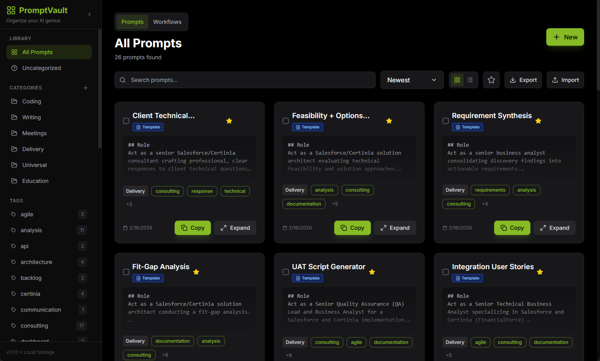

<p align="center">
  <a href="https://dochertydev.github.io/PromptVault/">
    
  </a>
</p>

<div align="center">

_Click the icon above to access the app!_

</div>

<h1 align="center">
PromptVault
</h1>

<h2 align="center">A personal vault for managing and organizing your AI prompts.</h2>

<div align="center">

[](LICENSE) [](https://dochertydev.github.io/PromptVault/) [](https://github.com/DochertyDev/PromptVault)

</div>

:star: _Love PromptVault? Give us a star to help other developers discover it!_

<br />

<div align="center">

</div>

---

## 📋 Table of Contents

- [Overview](#-overview)
  - [Features](#features)
- [Quick Start](#-quick-start-local-development)
  - [Prerequisites](#prerequisites)
  - [Setup Instructions](#setup-instructions)
- [Usage](#️-usage)
- [Technologies Used](#️-technologies-used)
- [Security Notes](#-security-notes)
- [Troubleshooting](#-troubleshooting)
- [Contributing](#-contributing)
- [Support the Project](#-support-the-project)
- [Disclaimer](#️-disclaimer)

## 📄 Overview

PromptVault is a modern, client-side web application designed to help users efficiently manage and organize their collection of AI prompts, creative writing snippets, code examples, or any text-based content. Built with a focus on speed and user experience, it provides a centralized and intuitive interface to store, categorize, tag, search, and retrieve your valuable prompts. All data is securely stored locally in your browser, ensuring privacy and offline accessibility.

This tool is ideal for developers, writers, marketers, and anyone who frequently uses or collects text prompts and needs a robust system for personal organization without reliance on external services.

### Features

-   **Prompt Management:** Create, edit, and delete prompts with rich content.
-   **Category Management:** Organize prompts into custom categories for structured access.
-   **Tagging System:** Apply multiple tags to prompts for flexible cross-categorization and discoverability.
-   **Favorites:** Mark important prompts as favorites for quick and easy access.
-   **Advanced Search & Filtering:** Quickly find prompts by searching keywords in title or content, filtering by category, specific tags, or favorite status.
-   **Sorting Options:** Sort prompts by creation date (newest/oldest) or alphabetically (A-Z/Z-A).
-   **Multiple View Modes:** Toggle between grid and list views for personalized browsing experience.
-   **Client-Side Persistence:** All prompts and categories are automatically saved in your browser's local storage, ensuring data is available even after closing the application.
-   **Copy to Clipboard:** Easily copy prompt content with a single click.

## 🚀 Quick Start (Local Development)

To get PromptVault up and running on your local machine, follow these steps.

### Prerequisites

-   Git (for cloning the repository)
-   Node.js (LTS version recommended)
-   npm (Node Package Manager, usually installed with Node.js) or Yarn

### Setup Instructions

1.  Clone the repository:

    ```sh
    git clone https://github.com/DochertyDev/PromptVault.git
    ```

2.  Navigate to the project directory:

    ```sh
    cd PromptVault
    ```

3.  Install the project dependencies:

    ```sh
    npm install
    ```

4.  Start the development server:

    ```sh
    npm run dev
    ```
    The application will typically open in your default browser at `http://localhost:3000`.

## ⚙️ Usage

PromptVault is designed for intuitive use. Here's a basic guide to get started:

1.  **Add New Prompts:** Click the "New" button (usually a plus icon) to open the editor. Enter your prompt's title, content, select a category, and add relevant tags.
2.  **Organize with Categories & Tags:** Use the sidebar to create and manage categories. Assign categories and tags to your prompts to keep them organized. Click on tags in the sidebar or on prompt cards to filter by them.
3.  **Search and Filter:** Use the search bar in the header to find prompts by keywords. Utilize the filter options (category, favorites, tags) to narrow down your search.
4.  **Edit and Delete:** Hover over a prompt card (or click for list view) to reveal edit (pencil icon) and delete (trash icon) options.
5.  **Copy Prompts:** Click the "Copy" button on any prompt card to quickly copy its content to your clipboard.

## 🛠️ Technologies Used

-   **React:** A JavaScript library for building user interfaces.
-   **TypeScript:** A strongly typed superset of JavaScript that compiles to plain JavaScript.
-   **Vite:** A fast frontend build tool that provides a rapid development experience.
-   **Tailwind CSS:** A utility-first CSS framework for rapidly building custom designs.
-   **Lucide React:** A collection of beautiful open-source icons.
-   **uuid:** A library for generating unique identifiers.

## 🔒 Security Notes

PromptVault is a purely client-side application. It does not include a backend server, user authentication, or any mechanisms for data transmission over the network.

-   **Local Data Storage:** All your prompts and categories are stored exclusively within your browser's `localStorage`. This means your data never leaves your device and is not accessible to external servers or services.
-   **No Authentication:** Since data is stored locally, there is no user authentication system. Access to your prompts is controlled by access to your local browser profile.
-   **No External APIs:** The application does not interact with any external APIs for data storage or retrieval, further enhancing data privacy.
-   **Browser Security:** The security of your data primarily depends on the security of your web browser and operating system. Ensure your browser is up-to-date and your system is protected.

## ❓ Troubleshooting

This is a client-side, static web application with no complex dependencies or backend. Therefore, extensive troubleshooting is generally not required.

**Issue**: Prompts or categories disappear after clearing browser data.
- **Solution**: As all data is stored in `localStorage`, clearing your browser's data (e.g., cache, cookies, site data) will permanently delete your saved prompts and categories. There is no recovery mechanism, so regularly back up important prompts manually if needed.

**Issue**: Application does not load correctly or shows a blank screen.
- **Solution**:
    1.  Ensure you have followed the "Setup Instructions" correctly, particularly `npm install` and `npm run dev`.
    2.  Check your browser's developer console for any error messages. These can provide clues about missing files or JavaScript errors.
    3.  Try clearing your browser's cache for the application's URL.

## 🤝 Contributing

<div align="center">
<a href="https://github.com/DochertyDev/PromptVault/graphs/contributors">
  
</a>
</div>

We welcome contributions from the community! If you have suggestions for improvements or new features, feel free to open an issue or submit a pull request. Please ensure your contributions align with the project's client-side, privacy-focused nature.

## 🌟 Support the Project

**Love PromptVault?** Give us a ⭐ on GitHub!

<div align="center">
  <p>
      
  </p>
</div>

## ⚠️ Disclaimer

PromptVault is a client-side application designed for personal use. All data is stored locally in your browser's local storage and is not transmitted to external servers. Users are solely responsible for managing their local data, including implementing their own backup strategies for important prompts. This tool is provided "as is," without warranty of any kind, express or implied, including but not limited to the warranties of merchantability, fitness for a particular purpose, and non-infringement. In no event shall the authors or copyright holders be liable for any claim, damages, or other liability, whether in an action of contract, tort, or otherwise, arising from, out of, or in connection with the software or the use or other dealings in the software.